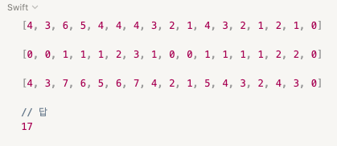

# Algorithm_Problem_Solving

### Started Migration to github
[algorithms problem solving](https://www.notion.so/fundamentaldeveloper/8a085ab32c2c4e3bb15825916d3abd1a)


### 1.14 (목)
### #Dynamic Programming #swift
<br>

```swift

import Foundation

let skyScrapers = [ 2, 9, 2, 3, 5, 3, 2, 8, 10, 12, 1, 3, 5, 8, 1, 3, 13 ]

//MARK:- ~번째 건물에서 오른쪽으로 보이는 건물 수
var dp_right = Array.init(repeating: 0, count: skyScrapers.count)
print(dp_right)

//MARK:- ~번째 건물에서 왼쪽으로 보이는 건물 수
var dp_left = Array.init(repeating: 0, count: skyScrapers.count)
print(dp_left)

//MARK:- 다이나믹 방식으로, 맨 오른쪽부터 왼쪽으로 이터레이션 하면서, 해당 인덱스 빌딩 우측으로 최초로 자기보다 더 높은 건물이 나오는 즉시
    // 그 건물의 디피값( 그 건물로 부터 오른쪽으로 보이는 건물의 수 )에 그 최초로 등장한 건물이 현재 인덱스 건물보다 높으니 +1 하여 dp_right에 기록
let rightIterOrder = Array( 0..<skyScrapers.count ).reversed()
outerLoop : for idx in rightIterOrder {
    if idx != skyScrapers.count - 1 {
        let tempIterOrder = Array( idx..<skyScrapers.count )
        for k in tempIterOrder {
            if skyScrapers[idx] < skyScrapers[k] {
                dp_right[idx] = dp_right[k] + 1
                continue outerLoop
            }
        }
    }
}
print(dp_right)

//MARK:- 다이나믹 방식으로, 맨 왼쪽부터 오른쪽으로 이터레이션 하면서, 해당 인덱스 빌딩 좌측으로 최초로 자기보다 더 높은 건물이 나오는 즉시
    // 그 건물의 디피값( 그 건물로 부터 오른쪽으로 보이는 건물의 수 )에다가, 그 최초의 건물이 현 인덱스 빌딩보다 높으니 +1 하여 dp_left에 기록하여 연산 횟수 줄이기
let leftIterOrder = Array( 0..<skyScrapers.count )
outerLoop : for idx in leftIterOrder {
    if idx != 0 {
        let tempIterOrder = Array( 0..<idx ).reversed()
        for k in tempIterOrder {
            if skyScrapers[idx] < skyScrapers[k] {
                dp_left[idx] = dp_left[k] + 1
                continue outerLoop
            }
        }
    }
}
print(dp_left)

var result = Array.init(repeating: 0, count: skyScrapers.count)
for i in 0..<result.count {
    result[i] = dp_right[i] + dp_left[i]
}

print(result)

var total = 0
for i in result {
    total += 1
}
print(total)

```
<br>


<br>


